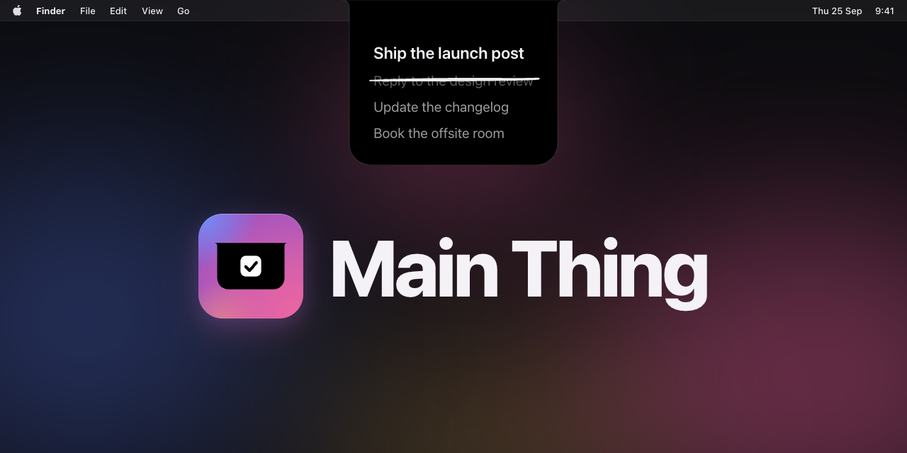
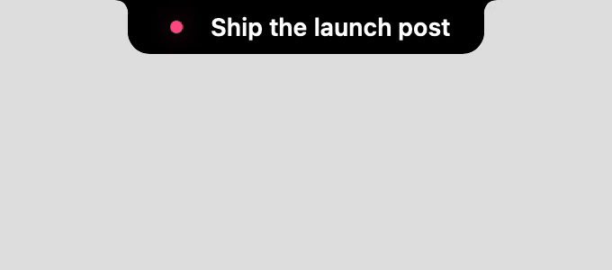

<p align="center"></p>

# Main Thing

Main Thing keeps the one task you are on in your Mac's notch.

[](https://github.com/jonnilundy/main-thing/releases/latest)
[](#install)
[](LICENSE)

The current task sits at the top of the screen, all day. Hover to see the rest of the list, click a task to cross it off. A command and a local API set the list, so your scripts and your AI agent can keep it current. No account and no server. Your list stays on your Mac. The only network calls are the daily update check and the adapters you install.

## Install

1. Download `MainThing.dmg` from the [latest release](https://github.com/jonnilundy/main-thing/releases/latest).
2. Open it and drag Main Thing to Applications.
3. Right click Main Thing in Applications, choose Open, then click Open. macOS asks this once, because the app is not signed with an Apple developer certificate.
4. If macOS still refuses, open System Settings, go to Privacy & Security, and click Open Anyway next to Main Thing.

The notch appears at the top of the screen. Right click it and choose Install Command Line Tool to get the `main-thing` command.

### Build from source

```sh
git clone https://github.com/jonnilundy/main-thing.git
cd main-thing
scripts/install.sh
```

Needs macOS 15 and Swift 6 (Xcode or its Command Line Tools). The script builds a release, puts `MainThing.app` in `~/Applications`, links `main-thing` into `~/.local/bin`, and starts the app.

## Usage

```sh
main-thing set "Write the memo" "Review the plan"   # replace the list
main-thing                                          # print the current task
main-thing list                                     # print the list, one task per line
main-thing done                                     # cross off the current task
main-thing done 2                                   # cross off the second task
main-thing help                                     # every command, the JSON shape, the API
```

In the notch:

- Hover to open it. The current task stays on top, the rest follow in order.
- Click a task to cross it off with a pen stroke. Click it again right away to keep it.
- Drag a task by its number to move it, or the current task by its dot. A task dropped on top is the new current task, and the old one moves to 2.
- Hover the bottom of the open card and click New task. Type, press Return to add it at the end, and type the next one. Escape closes the field.
- Press and hold a task for Rename and Discard. Rename edits the title in place: Return saves, Escape cancels. Discard deletes the task, and Undo shows in its place for 4 seconds.
- Right click for the menu: Sound, Reminder, Launch at Login, Check for Updates, Settings.



## Features

- **Reminder flash.** Every few minutes a colored band sweeps across the current task. The color steps through 10 hues, so the same color coming back tells you how long you have been on the task. Hover the dot to read the time.
- **Refs.** A task can carry its id in another tool, written `<adapter>:<id>`, for example `openbrain:qh75pbc`. `main-thing set --json -` and `main-thing list --json` keep refs.
- **Adapters.** Crossing off a task with a ref closes it in the tool it came from. Discarding a task only deletes it from the list.
- **Hooks.** An executable in `~/.config/main-thing/hooks/` runs on every change, with the event as JSON on stdin.
- **Sounds.** Pick a sound in the menu, or drop your own audio files into `~/.config/main-thing/sounds/`.
- **Updates.** Main Thing checks once a day, downloads in the background, and installs when you quit or pick Install Update from the menu. It never pops up a window on its own, and it only installs updates signed with the project's key.

## HTTP API

The command wraps a local API at `http://main-thing.localhost` (port 7788 if port 80 is taken, `main-thing health` says which).

| Request | What it does |
| --- | --- |
| `GET /tasks` | The list |
| `PUT /tasks` | Replace the list. Body: a JSON array of titles or `{"title","ref"}` objects |
| `POST /tasks/done` | Cross off the first task. Body `{"index":N}` or `{"ref":"..."}` picks another |
| `GET /health` | Is the app up, and on which port |

```sh
curl -X PUT main-thing.localhost/tasks -d '["Write the memo","Review the plan"]'
```

Loopback only. Requests with an `Origin` header are refused, so a web page cannot change your list.

## Adapters

An adapter is an executable at `~/.config/main-thing/adapters/<name>`. When a task with the ref `<name>:<id>` is crossed off, Main Thing runs `<name> complete <id>`.

- Open Brain: [adapters/openbrain/README.md](adapters/openbrain/README.md)

To write your own, see [adapters/README.md](adapters/README.md).

## Use it with your agent

Give your agent (Claude Code, Codex, Cursor, anything with a shell) this prompt:

```text
You manage my Main Thing list, the task shown in the notch at the top of my screen.
Run `main-thing help` once for the commands, the JSON shape and the API.
- Keep the list short and ordered, most important first. The first task is what I see all day.
- Read the list before you write it. Change only what we discussed.
- Keep every ref. It ties a task to another tool.
- Never mark a task done unless I say it is done.
```

## Troubleshooting

```sh
main-thing health       # is the app up, and on which port
main-thing logs         # ports, refused requests, hook and adapter runs
main-thing adapters     # installed adapters and why one did not run
main-thing port 7799    # pin another port, then relaunch the app
```

Task titles and hook output show as `<private>` in the log. An adapter or hook only runs if it is a regular file you own, executable, and not writable by group or others. The notch opens only when the cursor is over the black shape itself.

## Uninstall

Turn off Launch at Login in the notch menu, quit Main Thing, then:

```sh
rm -rf /Applications/MainThing.app ~/Applications/MainThing.app "$HOME/Library/Application Support/MainThing" ~/.local/bin/main-thing ~/.local/bin/mainthing ~/.config/main-thing ~/.config/mainthing
```

## Contributing

`scripts/test.sh` runs the checks, the hover and card probes, and a smoke test against a throwaway copy of the app in about 30 seconds. `scripts/test.sh --checks-only` skips the smoke test. `scripts/render-previews.sh <dir>` renders every notch state in `Sources/MainThingApp/Previews.swift` to PNGs in a few seconds, with no screen or cursor; it needs Xcode running with the package open. `scripts/package.sh` builds the DMG.

The probes run the real notch view in an invisible panel of their own, on a list in memory, and never move the cursor. `MainThing --bench-hover gap [notch|menubar|menubar24]` steps down the open card 1pt at a time and reads back from the rendered view which row is drawn hovered, for a hardware notch, a Studio Display menu bar row or a 24pt menu bar. `MainThing --probe-card` clicks, drags, long presses, renames, discards and adds with events sent inside the app, and checks the list after each.

Hover performance: `MainThing --bench-hover [seconds] [closed]` sweeps the open rows (or moves beside the collapsed notch) with synthesized moves in its own invisible panel and prints the main thread time per move; the cursor never moves. `scripts/bench-trace.sh <out.trace>` records a SwiftUI Instruments trace of the bench, `scripts/sweep-trace.sh <out.trace>` records one of the installed app while you sweep the rows by hand, and `scripts/trace-summary.py <file.trace>` prints hitches, commits, body updates and main thread hot spots of either.

## License

MIT. See [LICENSE](LICENSE).
