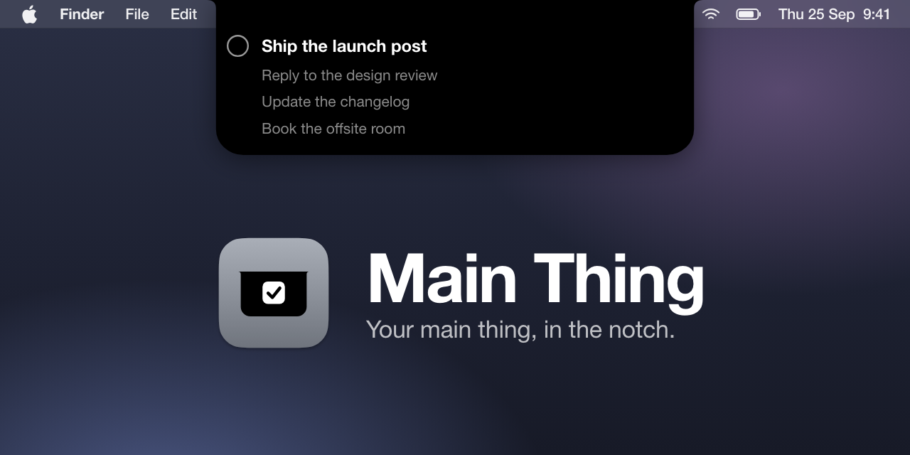

# Main Thing



Main Thing is a small Mac app with no Dock icon. It draws a notch at the top center of the screen and shows your current task in it. On a MacBook with a camera housing it hangs below the menu bar under the housing; on a screen without one it sits in the menu bar row. Hover to open it: the current task large, a circle to mark it done, and the next three. A local API sets the ordered list.

Requires macOS 14 or later. Builds with the Command Line Tools alone (Swift 6.2), no Xcode.

## Install

```sh
scripts/install.sh
```

Builds a release, quits any running copy, copies `MainThing.app` to `~/Applications`, links the `mainthing` command into `~/.local/bin` and starts the app. Launch at Login is in the right click menu on the notch.

## Set the list

The list is ordered. The first task is the current one.

```sh
mainthing set "Write the BAA memo" "Review Q3 KPIs" "Call the KumoMTA team"
mainthing                # prints the current task
mainthing list           # one task per line
mainthing done           # marks the current task done
mainthing health         # is the app up
```

Titles may hold quotes and apostrophes. One task per line from stdin:

```sh
printf 'Write the BAA memo\nReview Q3 KPIs\n' | mainthing set -
```

`MAINTHING_PORT` changes the port the command talks to. When the app is not running the command says so and exits 1.

## API

The command is a thin wrapper over the local HTTP API on `http://localhost:7788`. Any client works:

```sh
curl -X PUT http://localhost:7788/tasks -d '["Write the BAA memo","Review Q3 KPIs"]'
curl -X PUT http://localhost:7788/tasks -d '{"tasks":["Write the BAA memo","Review Q3 KPIs"]}'
curl http://localhost:7788/tasks
curl -X POST http://localhost:7788/tasks/done
curl http://localhost:7788/health
```

Titles are trimmed and blank ones are dropped. Every response is `{"tasks":[...]}`, except `/health` which returns `{"ok":true,"version":"0.1.0"}`.

Rules at the boundary:

- Loopback only. Nothing off the machine can reach it.
- `Host` must be `localhost`, `mainthing.localhost`, `127.0.0.1` or `[::1]`. Browsers resolve `mainthing.localhost` to loopback on their own, so `http://mainthing.localhost:7788` works there too.
- Any request with an `Origin` header is refused with 403, so a web page cannot change your list.
- Bad JSON is 400 with a one line reason. Bodies over 64 KB are 413. Unknown routes are 404, wrong methods 405.
- Content-Type does not matter, so a plain `curl -d` works.

Change the port the app listens on:

```sh
defaults write com.jonnilundy.mainthing port 7799
```

Then relaunch. The list is saved to `~/Library/Application Support/MainThing/tasks.json` as a plain JSON array.

## Notch menu

Right click the notch for:

- Launch at Login. Uses the system login items. If macOS asks for approval, the menu says so and opens System Settings.
- Show Tasks File. Reveals `tasks.json` in the Finder.
- Quit Main Thing.

## See what it is doing

```sh
log stream --predicate 'subsystem == "com.jonnilundy.mainthing"' --style compact
```

Bind errors, refused requests and save errors show up there. If the port is taken, the open notch says "API off on port N".

## Uninstall

Quit from the notch menu, turn Launch at Login off first if it is on, then:

```sh
rm -rf ~/Applications/MainThing.app "~/Library/Application Support/MainThing" ~/.local/bin/mainthing
```

## Develop

```sh
swift run mainthing-checks      # logic checks: parsing, routing, guards, list keys, hover, geometry
scripts/build-app.sh         # release build into build/MainThing.app
scripts/smoke.sh             # every route with curl and the mainthing command, against the running app
open build/MainThing.app --args --open   # start with the notch held open, for screenshots
```

Set `MAINTHING_SNAPSHOT_DIR=/some/dir` in the environment to get a PNG of the notch after each change, rendered by the app itself.

## Contributing

Build with the Command Line Tools only, no Xcode: `xcode-select --install`, then `swift run mainthing-checks` for the logic checks and `scripts/build-app.sh` for the app bundle. The bundle version comes from `MainThingVersion` in `Sources/MainThingCore/Version.swift`; change it in that one place. MIT licensed, see LICENSE.
