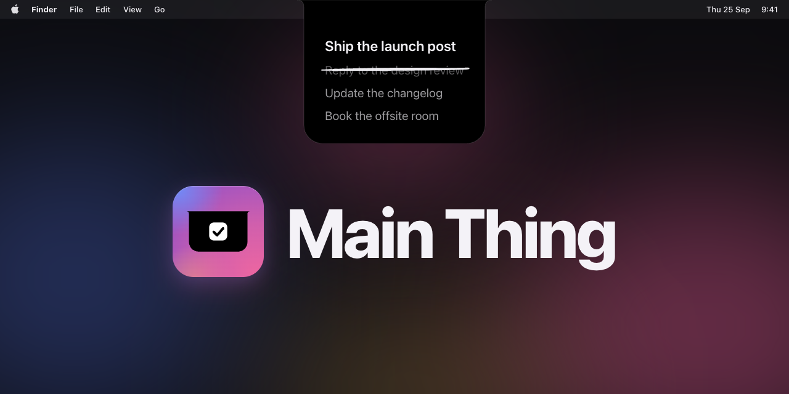
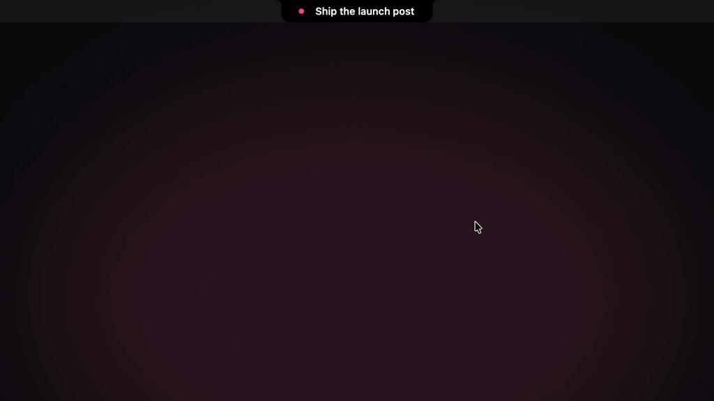

<p align="center"></p>

# Main Thing

Main Thing keeps the one task you are on in your Mac's notch.

[](https://github.com/jonnilundy/main-thing/releases/latest)
[](#install)
[](LICENSE)

The current task sits at the top of the screen, all day. Hover to see the rest of the list, click a task to cross it off. A command and a local API set the list, so your scripts and your AI agent can keep it current. No account and no server. Your list stays on your Mac. The only network calls are the daily update check and the adapters you turn on.

## Install

1. Download `MainThing.dmg` from the [latest release](https://github.com/jonnilundy/main-thing/releases/latest).
2. Open it and drag Main Thing to Applications.
3. Right click Main Thing in Applications, choose Open, then click Open. macOS asks this once, because the app is not signed with an Apple developer certificate.
4. If macOS still refuses, open System Settings, go to Privacy & Security, and click Open Anyway next to Main Thing.

The notch appears at the top of the screen. To get the `main-thing` command, right click the notch, choose Settings, and click Install next to Command line tool.

### Build from source

```sh
git clone https://github.com/jonnilundy/main-thing.git
cd main-thing
scripts/install.sh
```

Needs macOS 15 and Swift 6 (Xcode or its Command Line Tools). The script builds a release, puts `MainThing.app` in `~/Applications`, links `main-thing` into `~/.local/bin`, and starts the app.

## Usage

```sh
main-thing set "Write the memo" "Review the plan"   # replace the list
main-thing add "Book the room"                      # add a task at the end
main-thing add https://linear.app/acme/issue/ENG-1  # a link: an adapter fills in the title
main-thing                                          # print the current task
main-thing list                                     # print the list, one task per line
main-thing done                                     # cross off the current task
main-thing done 2                                   # cross off the second task
main-thing help                                     # every command, the JSON shape, the API
```

In the notch:

- Hover to open it. The current task stays on top, the rest follow in order.
- On a MacBook with a camera notch, the card grows out of the camera notch as one shape. With an empty list only the camera notch shows; hover it to open the list and add a task.
- Click a task to cross it off with a pen stroke. Click it again right away to keep it.
- Drag a task by its number to move it, or the current task by its dot. A task dropped on top is the new current task, and the old one moves to 2.
- Hover the bottom of the open card and click New task. Type, press Return to add it at the end, and type the next one. Escape closes the field.
- Press and hold a task for Rename and Discard. Rename edits the title in place: Return saves, Escape cancels. Discard deletes the task, and Undo shows in its place for 4 seconds.
- Right click for the menu: Launch at Login, Keyboard Shortcuts (every shortcut with its keys), Check for Updates, Settings and Quit. Settings has four tabs: General (sounds, reminder, the tasks file, the command line tool), Shortcuts, Adapters and Updates.



## Shortcuts

These shortcuts work from any app. To change one, open Settings, go to Shortcuts, click the shortcut and press the new keys. Click the x to clear it.

| Action | Default | What it does |
| --- | --- | --- |
| Show list | Control Option Space | Opens the list and gives it the keyboard (see [Keyboard](#keyboard)). It stays open until the pointer goes on it and leaves, you press the shortcut again, or you press Escape. |
| Add task | Control Option N | Opens the list with the New task field ready for typing. Return adds the task, Escape closes the field and the list. |
| Cross off main task | None | Crosses off task 1, the same as a click on it. It changes your list, so you set it yourself. |

Main Thing uses hot keys for these, so it needs no Accessibility permission. If Control Option Space already switches your input source, record another shortcut.

## Keyboard

When Show list or Add task opens the list, or you click in the list, the list has the keyboard until it closes. So Command Z right after a click undoes that cross off. The app in front stays in front. Only hovering the list does not take the keyboard.

| Key | What it does |
| --- | --- |
| Up, Down | Moves the highlight through the tasks and New task. |
| Tab, Shift Tab | The same, and goes round from the last to the first. |
| Return | Crosses off the highlighted task. On New task, opens the field. In the field, adds the task. |
| E | Renames the highlighted task in place. Return saves, Escape cancels. |
| Delete | Discards the highlighted task. |
| Option Up, Option Down | Moves the highlighted task up or down one place. |
| N | Goes to New task. |
| Command Z | Brings back the last task you crossed off or discarded. |
| Escape | Closes the field if one is open. Else closes the list and gives the keyboard back. |

The highlight looks the same as the hover. The pointer and the keys do not fight: the one you used last has the highlight. In the New task field that Add task opened, Escape closes the list too.

## Undo

A task you cross off or discard in the notch can come back for 4 seconds. Undo shows in its place, and its color drains from the word as the seconds run out. Click it, or press Command Z while the list has the keyboard (after a click in it, or after Show list or Add task). Each undo brings back the newest task still in its 4 seconds, at its old place and with its ref. If the list is closed, the task just comes back to the list.

A cross off in the notch (a click, Return, or Cross off main task) is final only when its 4 seconds end. The list changes at once and `list-changed` goes out, but `task-completed`, with its hook and its adapter (for example, Linear complete), goes out at the end. So an undo never has to reopen anything in another tool. If you quit Main Thing in those 4 seconds, it sends the waiting cross offs before it exits. `main-thing done` and `POST /tasks/done` are final at once, as before.

## Features

- **Reminder flash.** Every few minutes a colored band sweeps across the current task. The color steps through 10 hues, so the same color coming back tells you how long you have been on the task. Hover the dot to read the time.
- **Refs.** A task can carry its id in another tool, written `<adapter>:<id>`, for example `openbrain:qh75pbc`. `main-thing set --json -` and `main-thing list --json` keep refs.
- **Adapters.** Crossing off a task with a ref closes it in the tool it came from. Linear and Open Brain are built in: turn them on in Settings, Adapters. Discarding a task only deletes it from the list.
- **Links.** Paste a link to a Linear issue (or a task in any tool with an adapter that resolves links), in the New task field, `main-thing add` or the API. Main Thing shows a short placeholder, the adapter for that tool fills in the title and the ref, and crossing it off closes it there. A link no adapter knows stays as the title.
- **Hooks.** An executable in `~/.config/main-thing/hooks/` runs on every change, with the event as JSON on stdin.
- **Sounds.** Crossing off a task plays Cuelume's Loading cue, and a pasted link turning into its title plays Sparkle, with a small sparkle on the title. To pick another of the 17 Cuelume cues, the Pen scratch, your own file or Off, open Settings and change Sound or Link sound; picking one plays it once. Your own audio files go in `~/.config/main-thing/sounds/`.
- **Updates.** Main Thing checks once a day, downloads in the background, and installs when you quit or pick Install Update from the menu. It never pops up a window on its own, and it only installs updates signed with the project's key.

## HTTP API

The command wraps a local API at `http://main-thing.localhost` (port 7788 if port 80 is taken, `main-thing health` says which).

| Request | What it does |
| --- | --- |
| `GET /tasks` | The list |
| `PUT /tasks` | Replace the list. Body: a JSON array of titles or `{"title","ref"}` objects |
| `POST /tasks` | Add tasks at the end. Body: as for `PUT` |
| `POST /tasks/done` | Cross off the first task. Body `{"index":N}` or `{"ref":"..."}` picks another |
| `GET /health` | Is the app up, and on which port |

```sh
curl -X PUT main-thing.localhost/tasks -d '["Write the memo","Review the plan"]'
```

Loopback only. Requests with an `Origin` header are refused, so a web page cannot change your list.

## Adapters

An adapter connects Main Thing to another tool. When a task with the ref `<name>:<id>` is crossed off, Main Thing runs `<name> complete <id>`. When a new task is one link, Main Thing runs `<name> resolve <url>` to get its title and id.

### Built in: Linear and Open Brain

Both ship inside the app. Open Settings (right click the notch, Settings, or Cmd comma) and go to Adapters. For each one:

1. Turn on Enable. Both are off until you do.
2. Fill in the fields. Linear needs an API key. Open Brain needs its API URL and an API key. Each field says where to get the value, with a link.
3. Click Check. It asks the tool with your values (Linear: who owns the key. Open Brain: a read of one task) and shows OK or the error in plain words.

The section also shows the last run: when, the exit code, and the first line of the error.

Where the values go:

- API keys go in your login Keychain, one generic password per key. The service is `com.jonnilundy.mainthing.adapter.<name>` and the account is the variable name, for example `LINEAR_API_KEY`. Keychain Access shows them as "Main Thing: Linear API key".
- The Open Brain API URL is not a secret. It goes in the app's preferences.
- When Main Thing runs a built-in adapter, it gives the values to that one process as environment variables. They are never logged, printed or written to a file, and hooks and other adapters do not get them.

If you set an adapter up by hand before, with a file in `~/.config/main-thing/adapters/` or an env file such as `~/.config/main-thing/linear.env`, the update turns it on for you and it keeps working. The built-in script runs instead of the file in the adapters folder; that file is left as it is and does not run. The env file (plain values or `op://` references for the 1Password CLI) stays the fallback: an adapter reads it while a field in Settings is empty. Once every field is set in Settings, the env file is not read.

- Linear: [adapters/linear/README.md](adapters/linear/README.md)
- Open Brain: [adapters/openbrain/README.md](adapters/openbrain/README.md)

### Custom adapters

Any other executable at `~/.config/main-thing/adapters/<name>` is a custom adapter. It works as it always has. `main-thing adapters` lists them with whether each may run. The names `linear` and `openbrain` belong to the built-in adapters. To write your own, see [adapters/README.md](adapters/README.md).

## Use it with your agent

Give your agent (Claude Code, Codex, Cursor, anything with a shell) this prompt:

```text
You manage my Main Thing list, the task shown in the notch at the top of my screen.
Run `main-thing help` once for the commands, the JSON shape and the API.
- Keep the list short and ordered, most important first. The first task is what I see all day.
- Read the list before you write it. Change only what we discussed.
- Keep every ref. It ties a task to another tool.
- Never mark a task done unless I say it is done.
```

## Troubleshooting

```sh
main-thing health       # is the app up, and on which port
main-thing logs         # ports, refused requests, hook and adapter runs
main-thing adapters     # built-in and custom adapters, their last run, and why one did not run
main-thing port 7799    # pin another port, then relaunch the app
```

Task titles and hook output show as `<private>` in the log. An adapter or hook only runs if it is a regular file you own, executable, and not writable by group or others. The notch opens only when the cursor is over the black shape itself.

## Uninstall

Turn off Launch at Login in the notch menu, quit Main Thing, then:

```sh
rm -rf /Applications/MainThing.app ~/Applications/MainThing.app "$HOME/Library/Application Support/MainThing" ~/.local/bin/main-thing ~/.config/main-thing
security delete-generic-password -s com.jonnilundy.mainthing.adapter.linear -a LINEAR_API_KEY
security delete-generic-password -s com.jonnilundy.mainthing.adapter.openbrain -a OPEN_BRAIN_API_KEY
```

The last two lines remove the adapter keys from the Keychain, if you saved any.

## Contributing

`scripts/test.sh` runs the checks, the hover, card and adapter probes, the adapter scripts against a fake Linear and Open Brain, and a smoke test against a throwaway copy of the app in about 20 seconds. The adapter probe (`MainThing --probe-adapters`) uses a defaults suite and Keychain service of its own and removes them at the end. `scripts/test.sh --checks-only` skips the smoke test. `scripts/render-previews.sh <dir>` renders every notch state in `Sources/MainThingApp/Previews.swift` to PNGs in a few seconds, with no screen or cursor; it needs Xcode running with the package open. `scripts/package.sh` builds the DMG.

The probes run the real notch view in an invisible panel of their own, on a list in memory, and never move the cursor. The card probe's text field checks briefly take the keyboard focus, so run `scripts/test.sh` on a machine or a virtual machine you are not typing on. `MainThing --bench-hover gap [notch|menubar|menubar24]` steps down the open card 1pt at a time and reads back from the rendered view which row is drawn hovered, for a hardware notch, a Studio Display menu bar row or a 24pt menu bar. `MainThing --probe-card` clicks, drags, long presses, renames, discards and adds with events sent inside the app, and checks the list after each.

Hover performance: `MainThing --bench-hover [seconds] [closed]` sweeps the open rows (or moves beside the collapsed notch) with synthesized moves in its own invisible panel and prints the main thread time per move; the cursor never moves. `scripts/bench-trace.sh <out.trace>` records a SwiftUI Instruments trace of the bench, `scripts/sweep-trace.sh <out.trace>` records one of the installed app while you sweep the rows by hand, and `scripts/trace-summary.py <file.trace>` prints hitches, commits, body updates and main thread hot spots of either.

## Credits

[KeyboardShortcuts](https://github.com/sindresorhus/KeyboardShortcuts) by Sindre Sorhus records and runs the global shortcuts. MIT license.

[Cuelume](https://github.com/Danilaa1/cuelume) by Daniel Belyi designed the 17 cues. They are rendered once to `Resources/Sounds/cuelume/` by `scripts/render-cues/render.mjs`, with [its license](Resources/Sounds/cuelume/LICENSE). MIT license.

## License

MIT. See [LICENSE](LICENSE).
